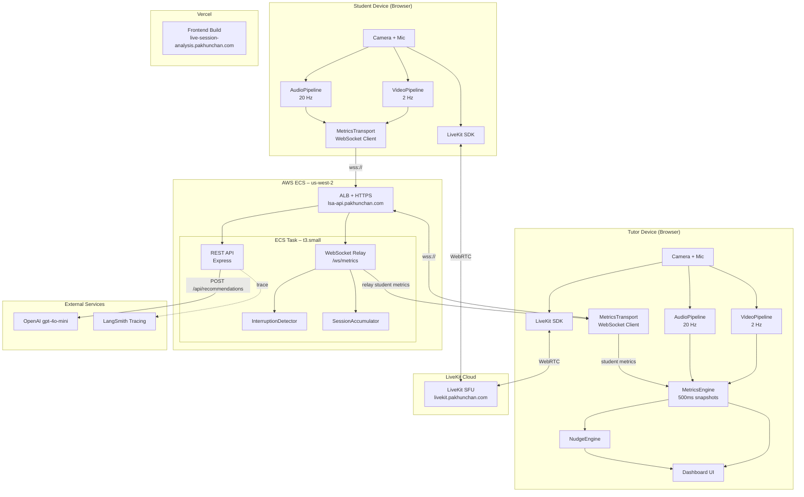
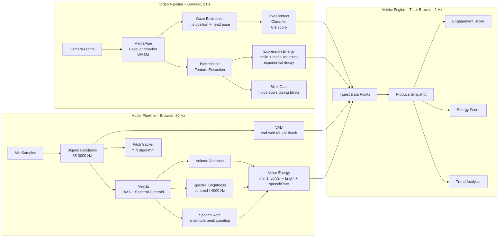
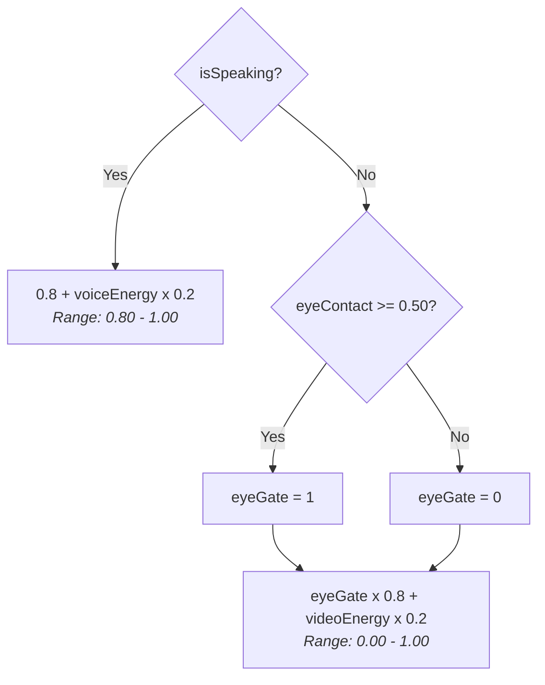
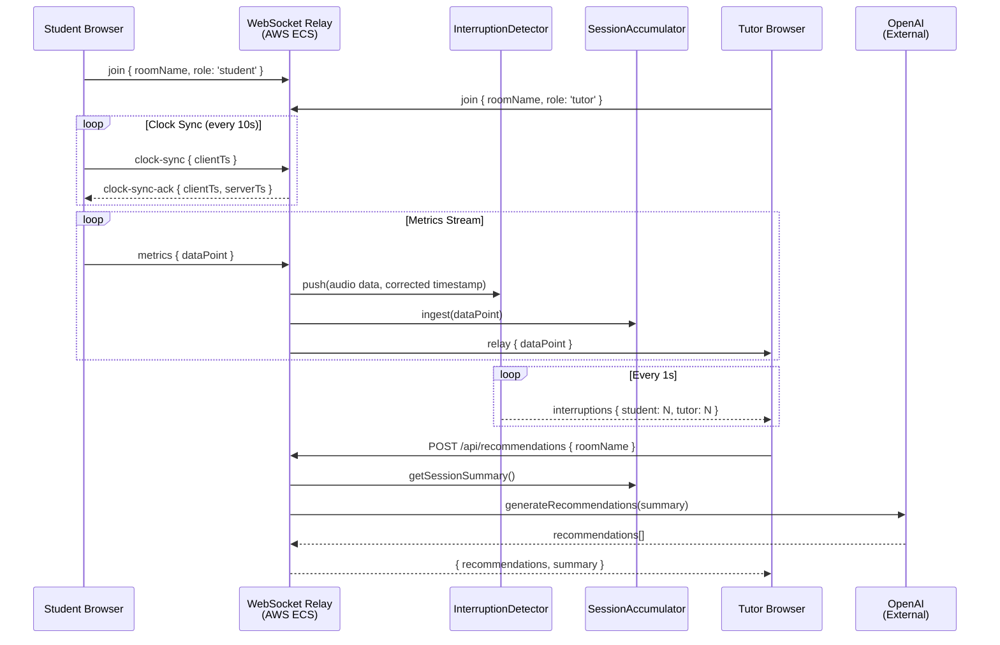
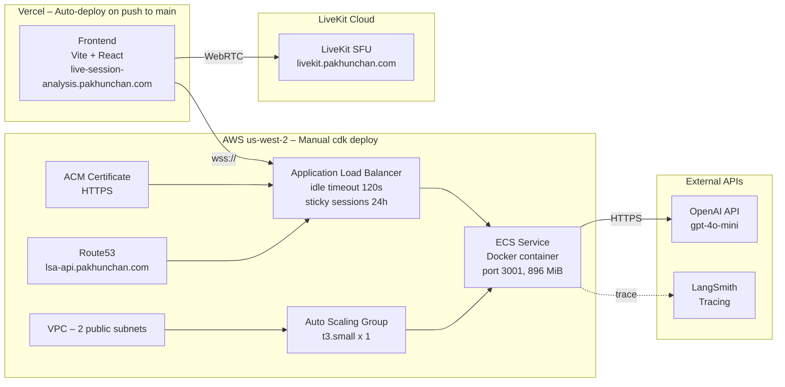

# Live Session Analysis

Real-time tutoring session analytics platform. A tutor and student connect via LiveKit WebRTC video/audio. Each device runs local MediaPipe face detection and Web Audio API analysis pipelines, producing per-frame metrics. These are relayed through a WebSocket backend that performs interruption detection and session accumulation. The tutor's dashboard renders engagement/energy scores, coaching nudges, and a session timeline in real time. On session end, an LLM generates coaching recommendations.

**Live:** [live-session-analysis.pakhunchan.com](https://live-session-analysis.pakhunchan.com)

---

## Install & Setup Guide

### Prerequisites

- **Node.js 20+** (matches the Docker production image)
- **npm**
- **AWS CLI + AWS CDK** (`npm install -g aws-cdk`) — only needed for backend deployment
- **Docker** — only needed for backend deployment (ECS runs a Docker container)

### Clone

```bash
git clone https://github.com/<your-org>/live-session-analysis.git
cd live-session-analysis
```

### Install All Dependencies

```bash
npm run install:all
```

Or install each package individually:

```bash
cd frontend && npm install
cd ../backend && npm install
```

### Environment Variables

#### Frontend (`frontend/`)

Create a `.env.local` in the `frontend/` directory (Vite picks up `VITE_*` vars automatically):

| Variable | Description | Example (local dev) |
|----------|-------------|---------------------|
| `VITE_LIVEKIT_URL` | LiveKit SFU WebSocket URL | `wss://livekit.pakhunchan.com` |
| `VITE_API_BASE_URL` | Backend REST API base URL | `http://localhost:3001` |
| `VITE_WS_URL` | Backend WebSocket URL | `ws://localhost:3001/ws/metrics` |

Production values are in `frontend/.env.production`.

#### Backend (`.env.local` at repo root)

Create a `.env.local` in the **repo root** (the backend dev script reads `../.env.local`):

| Variable | Description |
|----------|-------------|
| `OPENAI_API_KEY` | OpenAI API key (used for LLM recommendations) |
| `LANGCHAIN_API_KEY` | LangSmith API key (used for tracing) |
| `LIVEKIT_API_KEY` | LiveKit API key (used for token generation) |
| `LIVEKIT_API_SECRET` | LiveKit API secret (used for token generation) |

The backend also sets `LANGCHAIN_TRACING_V2=true` and `LANGCHAIN_PROJECT=live-session-analysis` in production (see `infra/lib/backend-stack.ts`).

### Run Locally

```bash
# Start both frontend and backend concurrently
npm run dev

# Or start them individually:
npm run dev:frontend   # Vite dev server (frontend/)
npm run dev:backend    # tsx with .env.local (backend/)
```

The frontend runs on Vite's default port (usually `http://localhost:5173`).
The backend listens on port `3001`.

### Run Tests

```bash
# Frontend unit tests (Vitest)
npm test

# Watch mode
cd frontend && npm run test:watch
```

### Run LLM Evals

```bash
npm run eval
```

This runs `backend/evals/run.ts` using the env vars from `.env.local`.

### Production Deploy

```bash
# Frontend — auto-deploys on push to main (Vercel)
git push origin main

# Backend — manual CDK deploy (AWS ECS)
export $(grep -v '^#' .env.local | xargs)
cd infra && npx cdk deploy
```

---

## Architecture



---

## Real-Time Metrics Pipeline



---

## Scoring Formulas

### Engagement Score



### Energy Score (Dashboard Display)

| State | Displayed Value | Source |
|-------|----------------|--------|
| Speaking | `voiceEnergy` | `min(1, volumeVariance + spectralBrightness + speechRate)` |
| Not speaking | `expressionEnergy` | `min(1, genuineSmile + headNodActivity + eyeWideness)` with exponential decay |

---

## Backend Flow



---

## Interruption Detection (Backend – AWS ECS)

Watermark-based processor running on corrected timestamps (NTP-style clock offset):

| Parameter | Value |
|-----------|-------|
| Established speaker threshold | 1000 ms |
| Minimum overlap for interruption | 500 ms |
| Speech gap debounce | 500 ms |
| Cooldown (speaker continues) | 3000 ms |
| Cooldown (speaker paused) | 2000 ms |

---

## Coaching Nudges (Client-side – Tutor Browser)

Evaluated on every metric snapshot, suppressed while tutor is speaking:

| Rule | Trigger | Cooldown |
|------|---------|----------|
| `student_silent` | Silence > 3 min | 2 min |
| `low_eye_contact` | Distraction > 4 s (face detected) | 90 s |
| `tutor_talk_dominant` | Tutor talk > 80% (after 60 s) | 2 min |
| `energy_drop` | Declining trend + low energy both sides | 3 min |
| `interruption_spike` | Total interruptions >= 3 | 3 min |

Rate limit: max 3 nudges/minute.

---

## Deployment



### Deploy Commands

```bash
# Frontend — auto-deploys on push to main (Vercel)
git push origin main

# Backend — manual CDK deploy (AWS ECS)
export $(grep -v '^#' .env.local | xargs)
cd infra && npx cdk deploy
```

---

## Project Structure

```
live-session-analysis/
├── frontend/                    # Vite + React — deployed on Vercel
│   └── src/
│       ├── audio/               # AudioPipeline, VAD, pitch, speech rate, voice energy
│       ├── video/               # VideoPipeline, FaceDetector, gaze, expression analysis
│       ├── core/                # MetricsEngine, EventBus, StreamManager, engagement
│       ├── coaching/            # NudgeEngine, default rules, AmbientBar
│       ├── dashboard/           # React UI — Sidebar, donuts, timeline, session setup
│       │   └── hooks/           # useMetricsEngine (tutor), useStudentPipeline (student)
│       ├── inputs/              # LiveKit adapter, file/live input adapters
│       └── types/               # TypeScript interfaces
├── backend/                     # Node.js Express + WS — deployed on AWS ECS
│   └── server/
│       ├── ws/                  # metricsRelay, interruptionDetector, sessionAccumulator
│       ├── routes/              # recommendations, livekit-token, health
│       └── langsmith/           # OpenAI call with LangSmith tracing
├── shared/                      # Shared types (frontend + backend)
└── infra/                       # AWS CDK stack (VPC, ECS, ALB, Route53, ACM)
```

---

## Tech Stack

| Layer | Technology | Runs On |
|-------|-----------|---------|
| Frontend framework | React + Vite + TypeScript | Vercel |
| Video/audio streaming | LiveKit (WebRTC SFU) | LiveKit Cloud |
| Face detection | MediaPipe FaceLandmarker (WASM) | Browser |
| Audio features | Meyda (RMS, spectral centroid) | Browser |
| Pitch detection | pitchfinder (YIN algorithm) | Browser |
| Voice activity | @ricky0123/vad-web (ML) + threshold fallback | Browser |
| Raw audio capture | Web Audio API (AnalyserNode + BiquadFilter) | Browser |
| Backend runtime | Node.js + Express + ws | AWS ECS |
| LLM recommendations | OpenAI gpt-4o-mini | OpenAI API |
| Observability | LangSmith tracing | LangSmith Cloud |
| Frontend hosting | Vercel (auto-deploy) | Vercel |
| Backend hosting | ECS on EC2 (t3.small) | AWS us-west-2 |
| Infrastructure-as-code | AWS CDK | AWS CloudFormation |
